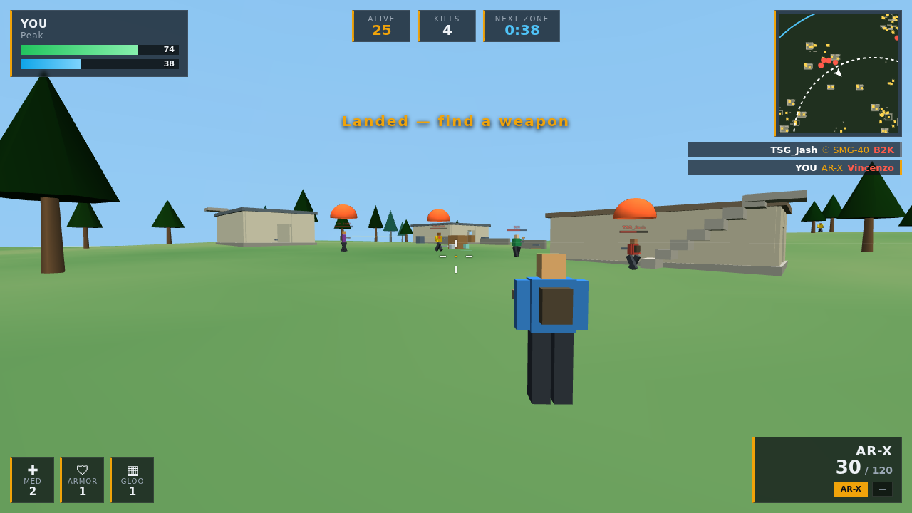

# Firestorm — Battle Royale

A browser battle royale in the spirit of Free Fire: parachute onto an island with
24 opponents, loot a weapon before they do, survive the shrinking safe zone, and
be the last one standing for a **BOOYAH**.

No build step, no server, no network calls — open `index.html` and play.



## Running it

```bash
# any static server works
npx http-server free-fire-game -p 8080
# then open http://localhost:8080
```

Opening `index.html` directly from disk works too, since everything is loaded as
plain scripts and Three.js is vendored in `vendor/`.

## Controls

| Input | Action |
| --- | --- |
| `W A S D` | Move |
| `Shift` | Sprint |
| `Ctrl` / `C` | Crouch |
| `Space` | Jump |
| Mouse | Look · left click fires · right click aims |
| `1` `2` `3` | Primary · sidearm · fists (mouse wheel swaps guns) |
| `R` | Reload |
| `E` | Pick up weapon |
| `H` / `J` | Med kit / armor plate |
| `F` | Deploy gloo wall |
| `M` | Full map |
| `Esc` | Pause |

On phones and tablets the touch layer appears automatically: left thumbstick to
move, drag the right half to look, plus fire, aim, jump, crouch, reload, swap,
med kit, gloo and pick-up buttons. Aim assist is on by default and can be turned
off in Settings.

## What a match looks like

1. **Drop.** Everyone leaves the same plane, each aimed at their own landing zone
   so the lobby scatters across the island. Freefall, auto-chute at 48 m, land.
2. **Loot.** Ammo, med kits, armor and gloo walls are picked up by walking over
   them; weapons need `E` (your first gun is grabbed automatically). Roughly 220
   items spawn per match, and everything a dead player carried drops where they
   fell.
3. **Fight.** Six weapon classes with real damage falloff, headshot multipliers,
   per-stance spread and recoil. Gloo walls give you instant cover that soaks
   400 damage.
4. **Rotate.** The safe zone contracts through six phases, dealing 1 → 16 damage
   per second outside. An airdrop with a top-tier weapon lands at 95 seconds.
5. **Win.** Last player alive gets the BOOYAH screen with kills, damage and
   survival time.

## Map

A 400 × 400 m island with nine named POIs — Clock Tower, Peak, Factory, Cape
Town, Mill Stone, Shipyard, Hangar, Riverside, Observatory — plus scattered huts
and cover in between. Buildings have doorways, interiors and external staircases
to fighting positions on the roofs. All static geometry is packed into a handful
of `InstancedMesh` draw calls.

## Bots

24 opponents run a small state machine — loot, roam, rotate, push, engage, heal —
with staggered perception so the whole lobby costs well under a millisecond per
frame. They vary in skill (0.3–0.85), which drives reaction time, aim tracking
speed, aim wander and spread. They spend the opening ~35 seconds looting rather
than starting cross-map duels, hear gunfire, take cover behind their own gloo
walls, heal when hurt, and fight each other as readily as they fight you. A
typical match runs 3–5 minutes with a steady attrition curve.

## Code layout

| File | Responsibility |
| --- | --- |
| `js/config.js` | Every tuning number: weapons, movement, zone phases, bot behaviour, loot tables |
| `js/utils.js` | Math, RNG, ray/box/sphere intersection, terrain height |
| `js/audio.js` | Procedurally synthesised SFX (no audio assets) |
| `js/world.js` | Terrain, POIs, buildings, stairs, collider broadphase grid |
| `js/entities.js` | Actor body shared by player and bots, ground loot, gloo walls |
| `js/combat.js` | Hitscan firing, cone spread, damage falloff, tracers and impacts |
| `js/zone.js` | Safe-zone phases, contraction, out-of-zone damage |
| `js/bots.js` | Bot AI state machine |
| `js/player.js` | Input (keyboard/mouse/touch), third-person camera |
| `js/hud.js` | Vitals, ammo, kill feed, minimap, full map, damage feedback |
| `js/game.js` | Match lifecycle: spawning, loot, airdrop, deaths, results |
| `js/ui.js` | Menus, settings persistence, results screen |

Collision is capsule-vs-AABB with a step height, so actors walk up stairs and
onto roofs without any slope colliders. Bullets are hitscan rays tested against a
uniform grid of boxes and three spheres per body (head, chest, legs).

## Tuning

Almost everything worth changing lives in `js/config.js`. A few examples:

```js
CFG.match.bots       = 24;    // lobby size (Settings exposes 8–40)
CFG.zone             = [...]; // hold/shrink/radius/dps per phase
CFG.bot.passiveUntil = 35;    // seconds before bots start long-range fights
CFG.weapons.arx.damage = 30;  // per-weapon stats
```

## Credits

Three.js r128 (MIT) is vendored in `vendor/` with its licence. Everything else —
geometry, audio, AI, UI — is generated at runtime by this repository's own code.
